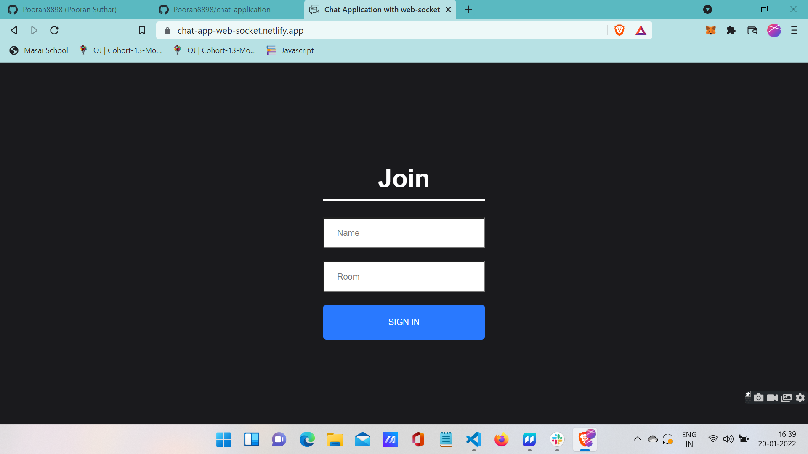
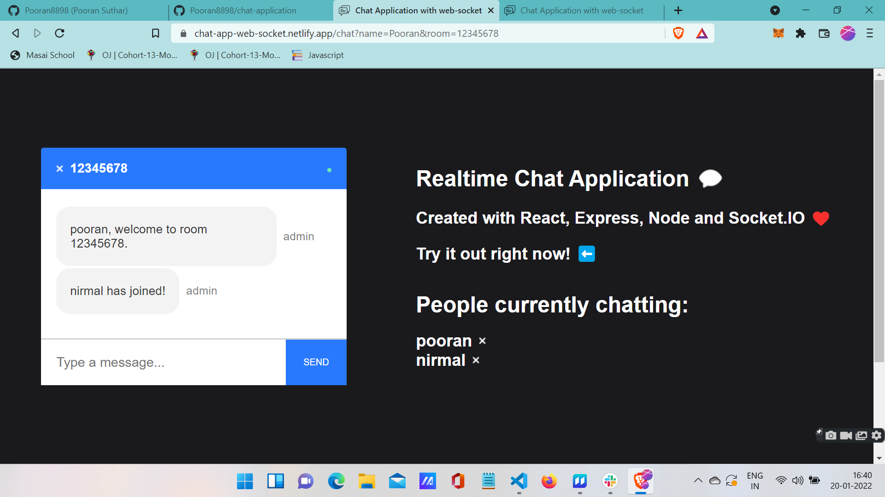
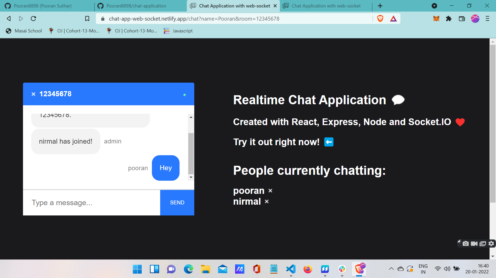
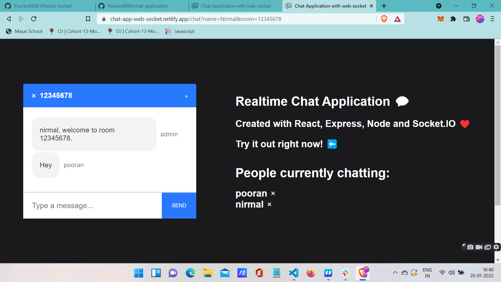
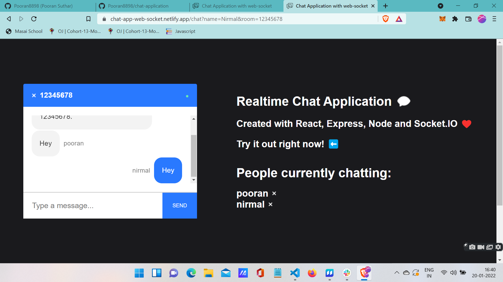
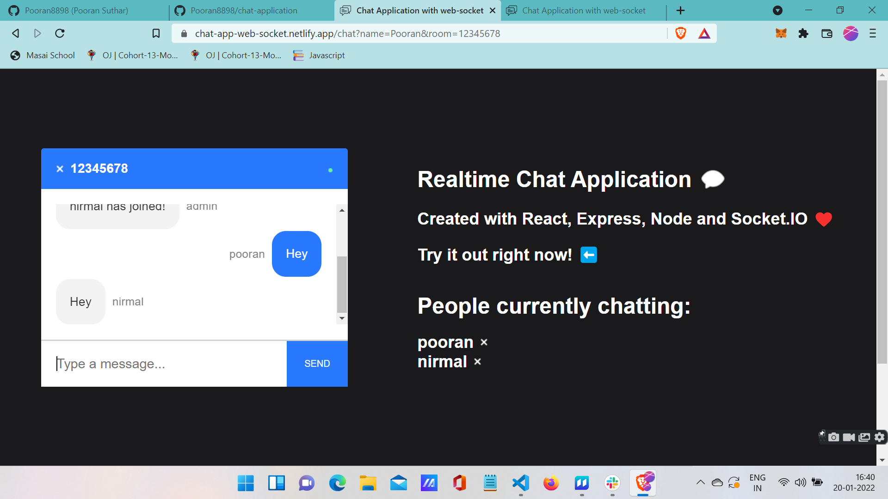

# Chat-application

### Chat-application is an website where you can have live chatting with your loved ones and you can create your own custom room according to the requirement.

# Technologies used
* [React]
* [express]
* [socket.io]
* [cors]
* [react-scroll-to-bottom]
* [socket.io-client]
* [react-router-dom]

# [DEMO LINK](https://chat-app-web-socket.netlify.app/)

# Steps to Browse the Project
### 1. Clone the Repository in your PC then there will be two different files one of the client for Frontend and the other one server for the backend. After opening each of the file install all the dependencies that are required to run both the files.Then open two different terminal one for frontend ,one for backend and run npm start on both the terminal so the backend will run in terminal and frontend will run on localhost://3000. You will see the following screen
#

### 2. After that you can enter the name and room you want to join.Click on enter as soon as you click enter you will be redirected to the chat room and you can see the greeting message for joining room along with that also the other members who are joining and leaving the room.
#

### 3.Its a Live Messaging Chat application you can share the message instant and it will be shared in the room asap.
#

#

### 4. The same goes for the reply by the next person. And you can see the names of all person who are there in the group
#

#

#### So this was our project I have created with my efforts. I have added the screensots for our audience to understand easily.

#### ## Thank you for giving it a read....

